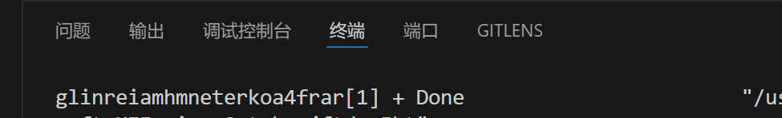

# 常用数据结构类型   
1. 随机存取： 指的是当存储器中的数据被读取或写入时，所需要的时间与该数据所在的物理地址无关。是数组的特征。  
2. 指针是一个特殊的变量，本质上指针就是是内存地址，指针变量是用来存放内存地址的变量。  
  指针变量的声明方法是`type *var_name`,其中var_name指指针变量的名称，例如`int *p`。
  指针的大小是固定的，都是跟内存的地址一样长。
3. 数组：例如，当我向存储十个相同类型的数据并随机提取其中的数据，此时可以创建一个数组。   
   链表：例如，当我需要需要频繁插入和删除元素的数据结构，可以利用链表实现。   
   栈： 例如，当我要改变元素的序列时，可以用栈实现。   
   队列：例如，可以用于任务调度，按照先后顺序执行任务，实现任务的有序处理。   
   图：图的结构更加复杂，有更广泛的应用场景，如社交 网络 、交通网络等   
4. (1) 使用`fopen`函数打开文件，获取文件指针。  
   (2) 读取文件的头部信息，获取图片的宽度，高度，像素位数等信息。  
   (3) 读取图片像素数据，将其存储到内存中的一个数组中。  
   (4) 用`fclose`函数关闭文件，用`free`函数释放内存。  

# 约瑟夫问题
解题途径： 通过b站、csdn学习了链表的基本操作，并了解了约瑟夫问题的解决办法（利用环形链表来寻找并输出要删除的元素）   
解题方法：因为头节点的数据为1，但在后期的删除中头节点的1会被删掉，所以我的代码中没有加入头节点的数据，第二次删掉第九位也就变成了删掉第八位；另外，我的代码中输入结果是一个一个的，而不是三个一起（导致输入的时候有点麻烦）   
过程：写代码，报错，修改，报错...修改*n....运行成功！   
数字串内容如下：
   

# 栈
解题途径：通过b站学习了栈的基本操作，即栈的初始化，栈的判空，压入，弹出，读取栈顶元素   
解题方法：主要是运用for循环和if语句来根据数字串进行压入弹出，本题中密文串有英文字母，所以用char，把数字串放到数组中，方便提取。  
输出结果如下：
